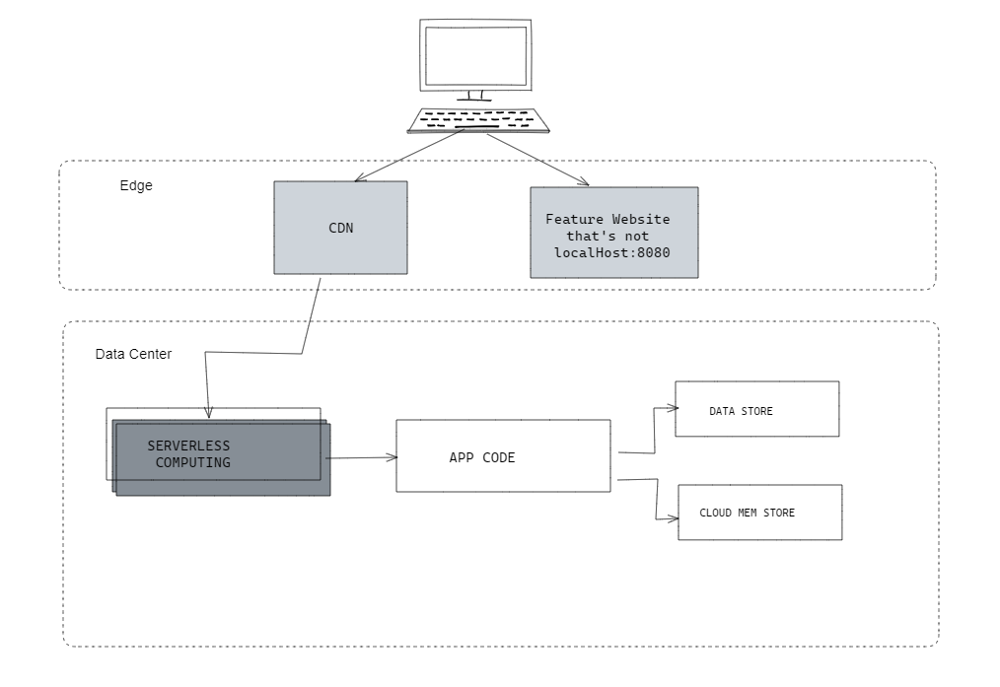
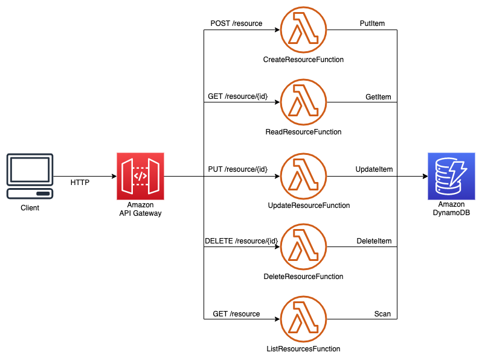

​<!-- HOW TO SCALE -->

  

  <h3 align="center">How to Scale to Millions of Users</h3>
  

<!-- TABLE OF CONTENTS -->

  
<h2 style="display: inline-block">Table of Contents</h2>

  <ol>
      <a href="#about-the-project">About The Project</a>
      <ul>
        <li><a href="#overview">Overview</a></li>
        <li><a href="#cdn">CDN</a></li>
        <li><a href="#backend-layers">Backend Layers</a></li>
        <li><a href="#serverless-functions">Serverless</a></li>
        <li><a href="#security">Security</a></li>
        <li><a href="#notes">Further Notes</a></li>
      </ul>
  </ol>

<!-- Overview -->
# Overview
### An influx of users is easily combated by Content Delivery Networks and Serverless Computing. I'm going to briefly explain the why of incorporating both within two common categories for backend layers: Business(Logic and SLAs) and Rendering.
 

## Benefits
<ol>
     <ul>
          <li><a href="#autonomy-with-configuration">Autonomy with Configuration</a></li>
          <li><a href="#palatable-fault-tolerance">Palatable fault tolerance</a></li>
          <li><a href="#services-deployed-independently">Services Deployed independently</a></li>
     </ul>
</ol>

#### Autonomy with Configuration
     Developers can consult and choose what's best for the business when it comes to cost and 
     optimization which lessens tech debt.

#### Palatable fault tolerance
     A vote of confidence towards system stability. We know if there's a pain point within 
     deployment it will have a limited influence on point in the system.

#### Services Deployed independently
     Quick deployments and test suites are implementable at this scale which in turn allows a 
     consistent standard of productivity.

  

# Backend Layers
<!-- Backend Layers -->
### Rendering Layer
     When there is an influx of traffic automatic provisioning is convenient in counteracting  
     new renders while fetching APIs within the Business Layer
### Business Layer
     This layer will transform data into a data model for the Rendering Layer. 
     The APIs run within an VM instance and paired with a Server Function for intensive 
     transformations into a data model.

   

<!-- CDN -->
# CDN
### Reducing traffic on our backend is important so this is handled by a need to temporarily store static data and common requests.

### A cache would be placed between serverless functions to circumvent the render layer from calling the business layer directly. This prevents the rendering layer from idle up-time and reduces billing overall. 
 

## Popular Choices
<ol>
     <ul>
          <li>AWS CloudFront</li>
          <li>Azure</li>
          <li>Akamai</li>
          <li>Cloudflare</li>
          <li>Fastly</li>
     </ul>
</ol>
 

### I'm choosing AWS CloudFront for simplicity and reliability. The automatic scaling proportionately responds to the amount of requests with little configuration. There is a higher cost per use associated with traffic but this is manageable either but limiting the resources towards core assets or by reviewing usage metrics.

   

<!-- Serverless Functions -->
# Serverless Functions
### Traffic fluctuates depending on a number of factors. Some events are expected but they can also be random. Autoscaling is good feature for handling larger loads of traffic that allows a team to focus on programming. Our use case will be on creating APIs for already existing applications without the need to modify.
 

## Popular Choices
<ol>
     <ul>
          <li>AWS Lambda</li>
          <li>GCP App Engine</li>
          <li>Redhat OpenShift</li>
          <li>Heroku</li>
     </ul>
</ol>

### I'm choosing AWS Lambda for the reduced cost and resilience. The problems of having to work around computational restrictions is outweighed by extensive logging, error handling, and quick setup. The tradeoff of decoupling the application code from the server while giving up control of the execution parameters is worth it -- considering the scaling for the functionality of this app. 

  

<!-- Security -->
# Security
<ol>
     <ul>
          <li>CSP Standard for Auth</li>
               

               OAuth and MFA is today's standard for dealing with common risks with cloud services.
               

          <li>Configurations</li>
               

               Within the CI/CD pipeline we should setup monitoring and logging tools along for health and security checks. This can also include setting function timeouts to a minimum to prevent interruption in execution calls.
               

          <li>Security Buffers</li>
               

               Transport Layer Security can be enabled by establishing SSL certificates with corresponding keys is needed to encrypt data sent over a connection. This prevents hackers from accessing important info.
               

          <li>Split App Environments</li>
               

               Splitting environments helps ensure vulnerability management is prioritized within development. This encourages testing at all stages in the process.
               

          <li>Least Privilege Principle</li>
               

               It's standard practice to prevent roles from invoking multiple functions. Excessive permissions gives attackers leverage. Doing this in combination with securing access control will help prevent misuse.
               

     </ul>
</ol>
  

<!-- Further Notes -->
# Notes
<ol>
     <ul>
          <li><a href="#cold-starts">Cold Starts</a></li>
          <li><a href="#analytics">Analytics</a></li>
     </ul>
</ol>
 

## Cold Starts
     The initial request within a serverless function is pretty important. There's a process where 
     the cloud copies code to a physical machine before launching the container. This instance 
     will stay-up so other requests won't need to perform a cold start.

     This doesn't completely account for a burst of traffic. We should factor-in our code, RAM 
     allocation per function, and runtime. AWS Lambda doesn't charge you for the computation 
     load during cold-start. Along with taking advantage of this feature, we should optimize the 
     RAM allocation to minimize cold start times.

 

## AWS is Convenient
     I wanted to try to take a generic approach when it comes to the choices of which technologies 
     you can use but AWS makes it very easy to put together and digest their infrastructure. It's 
     almost become the industry standard.

     You can configure and deploy serverless applications and then make a base container image in 
     a few minutes.
  

  

## Further Reading
<ol>
     <ul>
          <li>
               <a href="https://aws.amazon.com/blogs/compute/operating-serverless-at-scale-implementing-governance-part-1/"> Amazon Serverless Implementation
               </a>
          </li>
          <li>
               <a href="https://netflixtechblog.com/caching-for-a-global-netflix-7bcc457012f1"> Caching within Netflix
               </a>
          </li>
          <li>
               <a href="https://docs.aws.amazon.com/IAM/latest/UserGuide/best-practices.html?secd_iam7"> Security best practices in IAM
               </a>
          </li>
          <li>
               <a href="https://support.google.com/a/answer/9211704"> Security for Small Businesses
               </a>
          </li>
          <li>
               <a href="https://cloud.google.com/files/GCPDDoSprotection-04122016.pdf"> DDoS Protection and Mitigation
               </a>
          </li>
     </ul>
</ol>