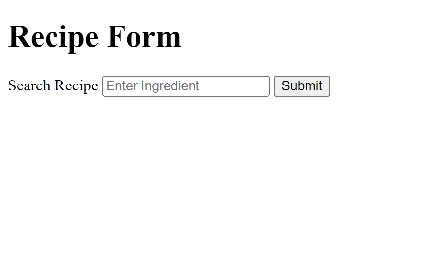

​<!-- PROJECT LOGO -->
<br />
<p align="center">
  <a href="https://github.com/TolulopeVerissimo/BE-engineer-assessment">
    
  </a>

  <h3 align="center">Senior BE Engineer (NodeJS) Assessment</h3>
  <p align="center">
    Built with a Express TypeScript as a Backend
    <br />
    <a href="https://github.com/TolulopeVerissimo/BE-engineer-assessment/wiki"><strong>Explore the docs »</strong></a>
    <br />
    <br />
    <a href="https://github.com/TolulopeVerissimo/BE-engineer-assessment/issues">Report Bug</a>
    
  </p>
</p>


<!-- TABLE OF CONTENTS -->
<details open="open">
  <summary><h2 style="display: inline-block">Table of Contents</h2></summary>
  <ol>
      <a href="#about-the-project">About The Project</a>
      <ul>
        <li><a href="#built-with">Built With</a></li>
        <li><a href="#installation">Installation</a></li>
        <li><a href="#contact">Contact</a></li>
      </ul>
  </ol>
</details>


<!-- ABOUT THE PROJECT -->
## About The Project
### 
<ol>
      <ul>
        <li><a href="https://github.com/TolulopeVerissimo/BE-engineer-assessment/blob/main/instructions.md">instructions.MD</a></li>
        <li><a href="https://github.com/TolulopeVerissimo/BE-engineer-assessment/blob/main/HowToScale.md">HowToScale.MD</a></li>
      </ul>
  </ol>


### Built With
[Express](https://expressjs.com/)


### Installation

 Clone the Project_Purple_Cow
   ```sh
     git clone https://github.com/TolulopeVerissimo/BE-engineer-assessment
   ```

   CD into project directory
   ```
     cd <project directory>
   ```
   Install the latest version
   ```
     npm i
   ```
   create .env file and add PORT of your choosing 
   ```
   touch .env
   PORT=3000
   ```

   Run
   ```
     npm run dev
   ```
   Open localhost with associated port in browser
   ```
     http://localhost:3000
   ```
</br>   

</br>   

### Run in PostMan
  Download PostMan and server is active
  ```
    GET http://localhost:3000/<INGREDIENT_NAME>
  ```

### Run in Vercel
  Go here and enter an ingredient in the search box.
  ```
    https://hostmeals.vercel.app/
  ```

<!-- CONTACT -->
## Contact

Lu Verissimo- [Github](https://github.com/TolulopeVerissimo) - t.e.veris15@gmail.com

Project Link: [https://github.com/TolulopeVerissimo/BE-engineer-assessment](https://github.com/TolulopeVerissimo/BE-engineer-assessment) 
